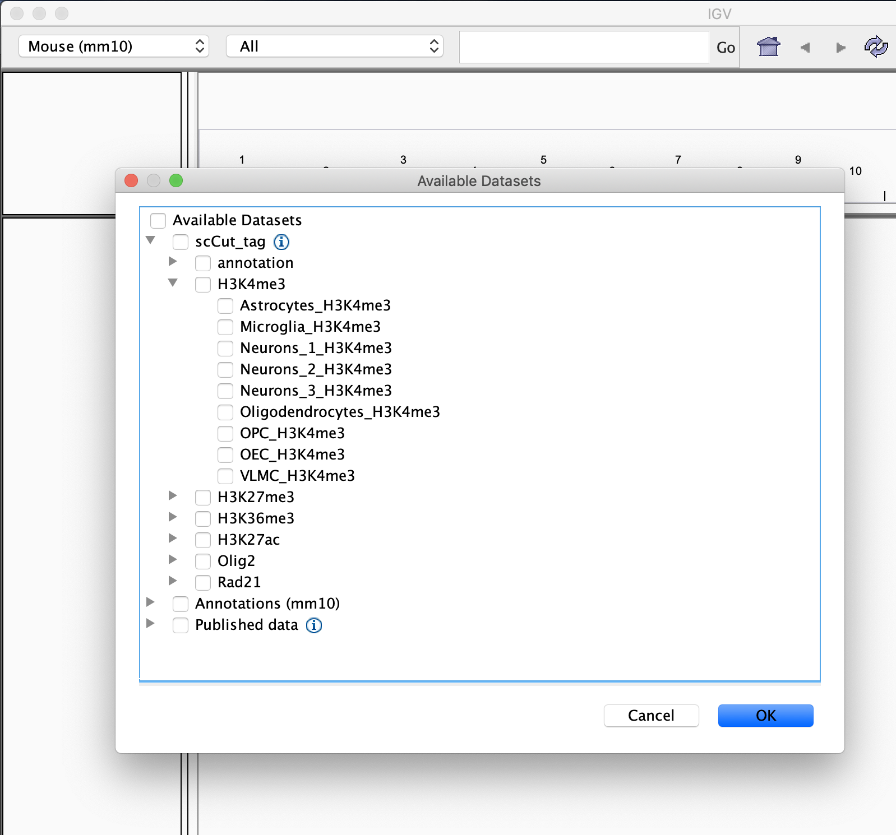
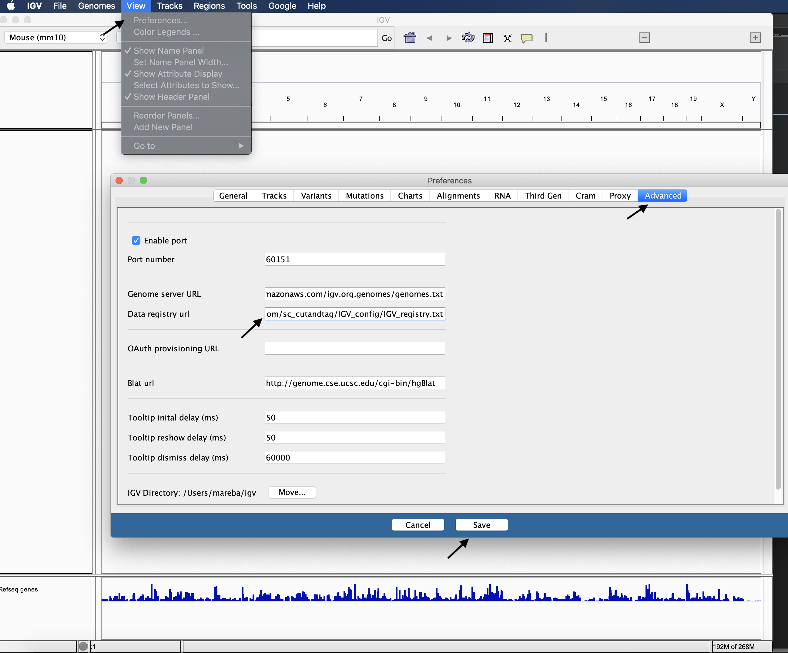

# single cell Cut&Tag  in the mouse brain
### Marek Bartosovic
### Goncalo Castelo-Branco lab

This repo contains code needed to generate figures for the paper 

    https://www.biorxiv.org/content/10.1101/2020.09.02.279703v1

The code is under development

## The analysis is performed in two steps:

1. Fastq files are processed using standard cellranger-atac count
2. Snakemake pipeline contains scripts and R markdown notebooks used for merging of the samples, analysis and figure generation

## Step 1. 

Each sequencing run is processed separately with cellranger:

    cellranger-atac count --fastqs=./fastq/ --reference=PATH_TO_CELLRANGER_REFERENCE_MM10 --sample=SEQUNCING_ID --id=SAMPLE_ID

## Step 2.

### Prepare 

cd into folder where you want to do the analyis
    
    mkdir scCut-Tag_2020
    cd scCut-Tag_2020

Clone the git repo

    git clone https://github.com/Castelo-Branco-lab/scCut-Tag_2020/master

Create conda environment with all necessary tools installed by:

    conda env create -f scCut-Tag_2020/envs/CT_snakemake.yaml
    conda env create -f scCut-Tag_2020/envs/meme.yaml

Install extra R libraries that are not present in conda or have trouble working:

    TODO 

### Modify config files

Modify config files in scCut-Tag_2020/config/step2/ to specify path to cellranger output files for individual samples

### Run Snakemake
    snakemake --cores 56 -p

## We also provide an IGV server with bw tracks for all modifications and cell types

### Change the URL to IGV server in IGV preferences
IGV -> View -> Preferences -> Advanced -> Data registry url

Change the URL to:

    https://raw.githubusercontent.com/mardzix/IGV_track_server/master/registry/IGV_registry.txt

Then, just go to File -> Load from server 

Enjoy!

